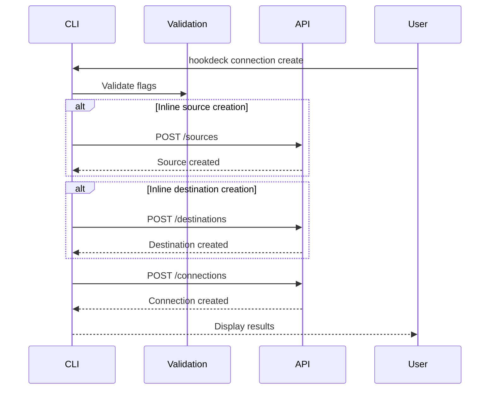

# Hookdeck CLI Connection Management Implementation Plan

## Executive Summary

This plan outlines the implementation of connection management commands for the Hookdeck CLI to support the localhost quickstart workflow. The implementation will focus on providing essential CRUD operations (create, list, get, update, delete) for connections, with support for inline source and destination creation.

## Scope

### In Scope (Phase 1 - Essential)
- `hookdeck connection create` - Create connections with inline source/destination creation
- `hookdeck connection list` - List connections with filtering
- `hookdeck connection get` - Get connection details
- `hookdeck connection update` - Update connection configuration
- `hookdeck connection delete` - Delete connections

### Out of Scope (Future Phases)
- `hookdeck connection enable/disable` - State management
- `hookdeck connection pause/unpause` - Pause functionality
- Bulk operations
- Interactive wizards
- Full source/destination CRUD (only inline creation initially)

## Developer Experience Considerations

### Why Full CRUD is Essential

Implementing only create/update/delete without list/get would severely impact developer experience:

1. **Discovery Issues**
   - No way to see existing connections
   - Can't find connection names or IDs
   - Blind updates without seeing current state

2. **Workflow Interruptions**
   - Forces developers to use web dashboard for basic tasks
   - Breaks CLI-first workflow
   - Increases context switching

3. **Debugging Challenges**
   - Can't verify connection state after operations
   - No way to inspect configuration
   - Difficult to troubleshoot issues

4. **Inconsistent Experience**
   - Violates user expectations from other CLIs
   - Incomplete resource management
   - Frustrating partial functionality

### Recommended Minimum Viable Implementation

To provide a satisfactory developer experience with caveats:

**Essential Commands (Phase 1):**
- `create` - With inline source/destination creation
- `list` - Basic listing with filtering
- `get` - View connection details
- `update` - Modify existing connections
- `delete` - Remove connections

**Acceptable Limitations:**
- No state management (enable/disable/pause) initially
- No interactive wizards
- Basic output formatting only
- Limited filtering options

**User Communication:**
- Document limitations clearly in help text
- Provide roadmap for future features
- Link to web dashboard for advanced features

## Technical Architecture

### Command Structure
```
hookdeck connection
├── create   # Create with inline resources
├── list     # List connections
├── get      # Get connection details
├── update   # Update configuration
└── delete   # Delete connection
```

### Flag Mapping Strategy

Following AGENTS.md guidelines for OpenAPI to CLI conversion:

#### Connection Creation Flags
```bash
# Connection-specific flags
--name                    # Connection name (required)
--description            # Connection description
--rules                  # JSON rules configuration

# Inline source creation (prefixed to avoid ambiguity)
--source-name            # Source name
--source-type            # Source type (WEBHOOK, STRIPE, etc.)
--source-description     # Source description
--source-webhook-secret  # Webhook secret for verification
--source-api-key        # API key for certain providers

# Inline destination creation (prefixed to avoid ambiguity)
--destination-name       # Destination name  
--destination-type       # Destination type (CLI, HTTP, MOCK)
--destination-url        # URL for HTTP destinations
--destination-description # Destination description
--destination-api-key    # API key for authentication
--destination-rate-limit # Rate limiting configuration

# Reference existing resources
--source-id             # Use existing source by ID
--destination-id        # Use existing destination by ID
```

#### Why Prefixed Flags for Inline Creation

When creating a connection with inline source and destination creation, we need to distinguish between source and destination parameters:

- `--source-type STRIPE` vs `--destination-type HTTP` (clear context)
- `--source-webhook-secret` vs `--destination-api-key` (no collision)
- Follows the pattern established in AGENTS.md section 2

### API Integration

#### Endpoints to Implement
```
POST   /connections           # Create connection
GET    /connections           # List connections
GET    /connections/{id}      # Get connection
PUT    /connections/{id}      # Update connection
DELETE /connections/{id}      # Delete connection

# For inline creation
POST   /sources              # Create source
POST   /destinations         # Create destination
```

#### Request Flow for Connection Creation


### Validation Strategy

#### Progressive Validation Layers

1. **Flag Parsing Validation**
   ```go
   // Ensure required flags are present
   // Validate flag value types
   // Check mutual exclusivity (inline vs reference)
   ```

2. **Type-Specific Validation**
   ```go
   // Source type validation
   if sourceType == "STRIPE" {
       // Require webhook-secret
       // Forbid basic-auth
   }
   
   // Destination type validation
   if destType == "HTTP" {
       // Require URL
       // Optional auth configuration
   }
   ```

3. **Cross-Parameter Validation**
   ```go
   // Can't specify both inline and reference
   if hasInlineSourceFlags() && sourceID != "" {
       return error("Cannot specify both inline source creation and source ID")
   }
   ```

4. **API Schema Validation**
   ```go
   // Final validation against OpenAPI constraints
   // Handled by API response
   ```

## Implementation Phases

### Phase 1: Core Connection CRUD (Week 1)

#### Task 1.1: Create Connection Command Structure
**Files to create:**
- `pkg/cmd/connection.go` - Main connection command group
- `pkg/cmd/connection_create.go` - Create with inline resources
- `pkg/cmd/connection_list.go` - List connections
- `pkg/cmd/connection_get.go` - Get connection details
- `pkg/cmd/connection_update.go` - Update connections
- `pkg/cmd/connection_delete.go` - Delete connections

#### Task 1.2: Implement API Client Methods
**Files to create/modify:**
- `pkg/hookdeck/connections.go` - Connection API methods
- `pkg/hookdeck/sources.go` - Source API methods (for inline creation)
- `pkg/hookdeck/destinations.go` - Destination API methods (for inline creation)
- `pkg/hookdeck/models.go` - Add connection models

#### Task 1.3: Add Validation Framework
**Files to create:**
- `pkg/validators/connection.go` - Connection-specific validation
- `pkg/validators/source.go` - Source type validation
- `pkg/validators/destination.go` - Destination type validation

### Phase 2: Testing & Documentation (Week 2)

#### Task 2.1: Add Unit Tests
**Files to create:**
- `pkg/cmd/connection_test.go` - Command tests
- `pkg/hookdeck/connections_test.go` - API client tests
- `pkg/validators/connection_test.go` - Validation tests

#### Task 2.2: Update Documentation
**Files to modify:**
- `REFERENCE.md` - Add connection command documentation
- `README.md` - Update with connection examples

#### Task 2.3: Integration Testing
- Test full workflow from quickstart guide
- Verify compatibility with existing `listen` command
- Test error scenarios and edge cases

## Code Examples

### Connection Create Command Implementation

```go
// pkg/cmd/connection_create.go
package cmd

import (
    "fmt"
    "github.com/spf13/cobra"
    "github.com/hookdeck/hookdeck-cli/pkg/hookdeck"
    "github.com/hookdeck/hookdeck-cli/pkg/validators"
)

type connectionCreateFlags struct {
    // Connection flags
    Name        string
    Description string
    Rules       string
    
    // Source flags (inline creation)
    SourceName        string
    SourceType        string
    SourceDescription string
    SourceWebhookSecret string
    
    // Destination flags (inline creation)
    DestinationName        string
    DestinationType        string
    DestinationURL         string
    DestinationDescription string
    
    // Reference existing resources
    SourceID      string
    DestinationID string
}

func newConnectionCreateCmd() *cobra.Command {
    var flags connectionCreateFlags
    
    cmd := &cobra.Command{
        Use:   "create",
        Short: "Create a new connection",
        Long: `Create a connection between a source and destination.
        
You can either reference existing resources by ID or create them inline.

Examples:
  # Create with inline source and destination
  hookdeck connection create \
    --name "stripe-to-local" \
    --source-type STRIPE --source-name "stripe-prod" \
    --destination-type CLI --destination-name "local-dev"
    
  # Create with existing resources
  hookdeck connection create \
    --name "github-to-api" \
    --source-id src_abc123 \
    --destination-id dst_def456`,
        PreRunE: func(cmd *cobra.Command, args []string) error {
            return validateConnectionCreateFlags(&flags)
        },
        RunE: func(cmd *cobra.Command, args []string) error {
            return runConnectionCreate(&flags)
        },
    }
    
    // Connection flags
    cmd.Flags().StringVar(&flags.Name, "name", "", "Connection name (required)")
    cmd.Flags().StringVar(&flags.Description, "description", "", "Connection description")
    cmd.Flags().StringVar(&flags.Rules, "rules", "", "Connection rules (JSON)")
    
    // Source inline creation flags
    cmd.Flags().StringVar(&flags.SourceName, "source-name", "", "Source name for inline creation")
    cmd.Flags().StringVar(&flags.SourceType, "source-type", "", "Source type (WEBHOOK, STRIPE, etc.)")
    cmd.Flags().StringVar(&flags.SourceDescription, "source-description", "", "Source description")
    cmd.Flags().StringVar(&flags.SourceWebhookSecret, "source-webhook-secret", "", "Webhook secret for verification")
    
    // Destination inline creation flags
    cmd.Flags().StringVar(&flags.DestinationName, "destination-name", "", "Destination name for inline creation")
    cmd.Flags().StringVar(&flags.DestinationType, "destination-type", "", "Destination type (CLI, HTTP, MOCK)")
    cmd.Flags().StringVar(&flags.DestinationURL, "destination-url", "", "URL for HTTP destinations")
    cmd.Flags().StringVar(&flags.DestinationDescription, "destination-description", "", "Destination description")
    
    // Reference existing resources
    cmd.Flags().StringVar(&flags.SourceID, "source-id", "", "Use existing source by ID")
    cmd.Flags().StringVar(&flags.DestinationID, "destination-id", "", "Use existing destination by ID")
    
    cmd.MarkFlagRequired("name")
    
    return cmd
}

func validateConnectionCreateFlags(flags *connectionCreateFlags) error {
    // Check for inline vs reference mode
    hasInlineSource := flags.SourceName != "" || flags.SourceType != ""
    hasInlineDestination := flags.DestinationName != "" || flags.DestinationType != ""
    
    // Validate source configuration
    if hasInlineSource && flags.SourceID != "" {
        return fmt.Errorf("cannot specify both inline source creation and source ID")
    }
    if !hasInlineSource && flags.SourceID == "" {
        return fmt.Errorf("must specify either source creation flags or --source-id")
    }
    
    // Validate destination configuration
    if hasInlineDestination && flags.DestinationID != "" {
        return fmt.Errorf("cannot specify both inline destination creation and destination ID")
    }
    if !hasInlineDestination && flags.DestinationID == "" {
        return fmt.Errorf("must specify either destination creation flags or --destination-id")
    }
    
    // Type-specific validation for inline creation
    if hasInlineSource {
        if err := validators.ValidateSourceType(flags.SourceType, flags); err != nil {
            return err
        }
    }
    
    if hasInlineDestination {
        if err := validators.ValidateDestinationType(flags.DestinationType, flags); err != nil {
            return err
        }
    }
    
    return nil
}

func runConnectionCreate(flags *connectionCreateFlags) error {
    client := hookdeck.NewClient()
    
    var sourceID, destinationID string
    
    // Create source if needed
    if flags.SourceID != "" {
        sourceID = flags.SourceID
    } else {
        source, err := client.CreateSource(hookdeck.CreateSourceRequest{
            Name:          flags.SourceName,
            Type:          flags.SourceType,
            Description:   flags.SourceDescription,
            WebhookSecret: flags.SourceWebhookSecret,
        })
        if err != nil {
            return fmt.Errorf("failed to create source: %w", err)
        }
        sourceID = source.ID
        fmt.Printf("✓ Source created: %s (%s)\n", source.Name, source.ID)
        fmt.Printf("  Source URL: %s\n", source.URL)
    }
    
    // Create destination if needed
    if flags.DestinationID != "" {
        destinationID = flags.DestinationID
    } else {
        dest, err := client.CreateDestination(hookdeck.CreateDestinationRequest{
            Name:        flags.DestinationName,
            Type:        flags.DestinationType,
            URL:         flags.DestinationURL,
            Description: flags.DestinationDescription,
        })
        if err != nil {
            return fmt.Errorf("failed to create destination: %w", err)
        }
        destinationID = dest.ID
        fmt.Printf("✓ Destination created: %s (%s)\n", dest.Name, dest.ID)
    }
    
    // Create connection
    connection, err := client.CreateConnection(hookdeck.CreateConnectionRequest{
        Name:          flags.Name,
        Description:   flags.Description,
        SourceID:      sourceID,
        DestinationID: destinationID,
        Rules:         flags.Rules,
    })
    if err != nil {
        return fmt.Errorf("failed to create connection: %w", err)
    }
    
    // Display results
    fmt.Printf("\n✓ Connection created successfully\n\n")
    fmt.Printf("Connection:  %s (%s)\n", connection.Name, connection.ID)
    fmt.Printf("Source:      %s (%s)\n", connection.Source.Name, connection.Source.ID)
    fmt.Printf("Destination: %s (%s)\n", connection.Destination.Name, connection.Destination.ID)
    
    return nil
}
```

### Validation Implementation

```go
// pkg/validators/source.go
package validators

import (
    "fmt"
)

func ValidateSourceType(sourceType string, flags interface{}) error {
    switch sourceType {
    case "STRIPE":
        return validateStripeSource(flags)
    case "GITHUB":
        return validateGitHubSource(flags)
    case "WEBHOOK":
        // Generic webhook - minimal validation
        return nil
    default:
        return fmt.Errorf("unsupported source type: %s", sourceType)
    }
}

func validateStripeSource(flags interface{}) error {
    // Type assertion to access flags
    f, ok := flags.(*connectionCreateFlags)
    if !ok {
        return fmt.Errorf("invalid flags type")
    }
    
    if f.SourceWebhookSecret == "" {
        return fmt.Errorf("--source-webhook-secret is required for Stripe sources")
    }
    
    return nil
}
```

## Testing Strategy

### Unit Tests
- Test flag validation logic
- Test type-specific validation
- Test API client methods with mocks
- Test error handling

### Integration Tests
- Test full connection creation flow
- Test with existing `listen` command
- Test error scenarios
- Test update and delete operations

### Manual Testing Checklist
- [ ] Create connection with inline source/destination
- [ ] Create connection with existing resources
- [ ] List connections with various filters
- [ ] Get connection details
- [ ] Update connection configuration
- [ ] Delete connection
- [ ] Verify compatibility with `listen` command
- [ ] Test validation errors
- [ ] Test API errors

## Documentation Plan

### REFERENCE.md Updates
```markdown
## Connections

Connections link sources to destinations and define how webhooks are routed.

### Create a connection

Create a new connection with inline source and destination:

```bash
hookdeck connection create \
  --name "stripe-to-local" \
  --source-type STRIPE \
  --source-name "stripe-prod" \
  --source-webhook-secret "whsec_..." \
  --destination-type CLI \
  --destination-name "local-dev"
```

Create a connection with existing resources:

```bash
hookdeck connection create \
  --name "github-to-api" \
  --source-id src_abc123 \
  --destination-id dst_def456
```

### List connections

```bash
# List all connections
hookdeck connection list

# Filter by source
hookdeck connection list --source stripe-prod

# Filter by destination  
hookdeck connection list --destination local-dev
```

### Get connection details

```bash
hookdeck connection get conn_xyz789
```

### Update a connection

```bash
hookdeck connection update conn_xyz789 \
  --description "Updated description" \
  --rules '{"retry": {"count": 3}}'
```

### Delete a connection

```bash
hookdeck connection delete conn_xyz789
```
```

## Success Metrics

### Phase 1 Completion Criteria
- [ ] All 5 connection commands implemented (create, list, get, update, delete)
- [ ] Inline source/destination creation working
- [ ] Validation framework in place
- [ ] Basic tests passing
- [ ] Documentation updated

### User Experience Goals
- [ ] Commands work as shown in quickstart guide
- [ ] Clear error messages with actionable guidance
- [ ] Consistent with existing CLI patterns
- [ ] Output format matches existing commands

## Known Limitations & Future Work

### Current Limitations
1. No interactive mode for connection creation
2. No state management commands (enable/disable/pause)
3. Basic output formatting only
4. Limited filtering options for list command
5. No bulk operations

### Future Enhancements
1. Add interactive creation wizard
2. Implement state management commands
3. Add JSON/YAML output formats
4. Enhanced filtering and search
5. Bulk operations support
6. Full source/destination CRUD commands
7. Connection testing/validation commands

## Risk Mitigation

### Technical Risks
1. **API Changes**: Use versioned API endpoints, implement proper error handling
2. **Complex Validation**: Start simple, iterate based on user feedback
3. **Inline Creation Failures**: Implement rollback or clear error messaging

### User Experience Risks
1. **Incomplete CRUD**: Clearly document limitations and roadmap
2. **Complex Flags**: Provide clear examples and help text
3. **Migration Path**: Ensure compatibility with existing workflows

## Conclusion

This implementation plan provides a minimal but complete connection management experience that:

1. **Meets quickstart requirements** - Supports the exact workflow shown
2. **Provides essential CRUD** - All basic operations available
3. **Maintains consistency** - Follows existing CLI patterns
4. **Sets foundation** - Enables future enhancements
5. **Acknowledges limitations** - Clear about what's not included

The phased approach allows for quick delivery of core functionality while maintaining quality and setting up for future improvements.