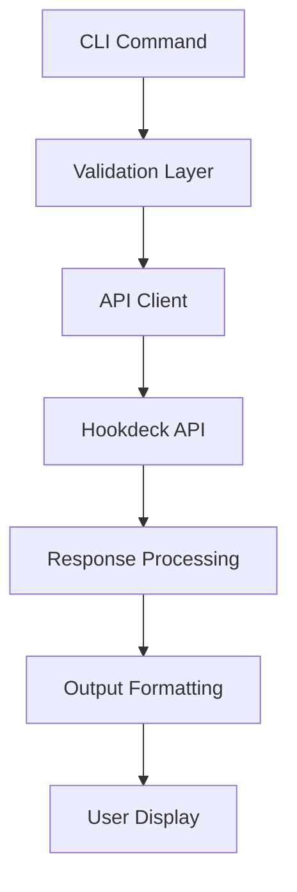

# Hookdeck CLI Resource Management Implementation Plan

## Implementation Status

### ✅ Completed (October 2025)
- **Connection Management** - 98% complete and production-ready
  - [x] `connection create` - With inline source/destination creation, full authentication support
  - [x] `connection list` - With comprehensive filtering (name, source, destination, archived, disabled, paused)
  - [x] `connection get` - Detailed view with full configuration
  - [x] `connection upsert` - Idempotent create/update with `--dry-run` support (replaces `update`)
  - [x] `connection delete` - With confirmation prompts
  - [x] `connection enable/disable` - State management
  - [x] `connection pause/unpause` - Temporary suspension
  - [x] `connection archive/unarchive` - Long-term archival
  - [x] **Source Authentication** - 96+ types with webhook-secret, api-key, basic-auth, HMAC, JSON fallback ([Commit 8acf8d3](https://github.com/hookdeck/hookdeck-cli/commit/8acf8d3))
  - [x] **Destination Authentication** - Bearer token, basic-auth, api-key, custom headers, OAuth2 ([Commit 8acf8d3](https://github.com/hookdeck/hookdeck-cli/commit/8acf8d3))
  - [x] **Rule Configuration** - All 5 types (retry, filter, transform, delay, deduplicate) with ordered execution ([Commit 8acf8d3](https://github.com/hookdeck/hookdeck-cli/commit/8acf8d3))
  - [x] **Rate Limiting** - Full destination rate limiting configuration
  
  **See:** [`.plans/connection-management/connection-management-status.md`](./connection-management/connection-management-status.md) for comprehensive documentation
  
### 🚧 In Progress / Next Priority
- **Source Management** (Priority 1 - Week 1)
  - [ ] `source list` - Essential for discovery
  - [ ] `source get` - View details and webhook URL
  - [ ] `source update` - Update authentication
  - [ ] `source delete` - Clean up unused
  
- **Destination Management** (Priority 1 - Week 1)
  - [ ] `destination list` - Essential for discovery
  - [ ] `destination get` - View configuration
  - [ ] `destination update` - Critical for URL changes
  - [ ] `destination delete` - Clean up unused

### ✅ Recent (February 2026)
- **Transformation examples** - All examples updated to `addHandler("transform", ...)` format (README, REFERENCE, pkg/cmd, tests)
- **Transformation run** - API response model fixed to match OpenAPI; CLI displays transformed output; default content-type for empty headers

### 📋 Planned
- **Transformation Management** (Priority 2 - Week 2) - CRUD already present; examples and run output now correct
- **Project Management Extensions** (Priority 3 - Week 3)
- **Advanced Features** (Future)


---

## Testing and sandbox

- **Always run tests** when implementing or changing code. Do not skip tests to avoid failures.
- If tests fail due to **TLS/certificate errors**, **network**, or **sandbox** (e.g. `x509`, `operation not permitted`), **prompt the user** and **re-run with elevated permissions** (e.g. `required_permissions: ["all"]`) so tests can pass.

## Background

The Hookdeck CLI currently supports limited commands in `@pkg/cmd` with basic project management. This plan outlines implementing comprehensive resource management for projects, connections, sources, destinations, and transformations using the Hookdeck API (https://api.hookdeck.com/2025-07-01/openapi).

## OpenAPI to CLI Conversion Strategy

**See [`AGENTS.md`](../AGENTS.md) for comprehensive guidance on:**
- **Section 2:** Parameter mapping rules (nested JSON → flat CLI flags), flag naming conventions, ordered array configurations
- **Section 3:** Conditional validation with type-driven validation
- **Section 11:** Idempotent upsert pattern, common patterns to follow

**Key Patterns Established:**
- **Ordered array configurations** - Rule ordering via flag position (e.g., `--rule-retry-*`, `--rule-filter-*`)
- **Idempotent operations** - `upsert` commands with `--dry-run` support for declarative management
- **Type-driven validation** - Progressive validation based on `--type` parameters
- **JSON fallback** - Complex configurations via `--rules`, `--rules-file`, `--config`, `--config-file`
- **Plural alias for resource commands** - Every resource command group uses singular as primary `Use` and **must** have the plural as an alias (e.g. `source`/`sources`, `connection`/`connections`, `project`/`projects`). See AGENTS.md § Resource command naming and plural alias.

All CLI commands must follow these established patterns for consistency across the codebase.

## Objectives

1. **Extend project management** - Add create, update, delete capabilities beyond current list/use
2. ~~**Implement connection management**~~ - ✅ COMPLETE (98%, production-ready)
3. **Add source management** - Manage webhook sources with various provider types
4. **Add destination management** - Manage HTTP, CLI, and Mock API destinations
5. **Add transformation management** - Manage JavaScript code transformations
6. ~~**Create reference documentation**~~ - ✅ REFERENCE.md generated via `go run ./tools/generate-reference` from Cobra metadata
7. **Maintain consistency** - Follow existing CLI patterns and architecture

## Success Criteria

- All resource types support standard CRUD operations (list, get, create, update, delete)
- Commands follow existing CLI patterns and conventions
- Comprehensive error handling and validation
- Interactive selection for user-friendly experience
- Clear, actionable reference documentation
- Backward compatibility with existing commands

---

## Task List

### Phase 1: Foundation and Project Enhancement

#### Task 1.1: Extend Project Commands
**Files to modify:**
- `pkg/cmd/project.go` - Add new subcommands
- `pkg/cmd/project_create.go` (new)
- `pkg/cmd/project_update.go` (new) 
- `pkg/cmd/project_delete.go` (new)
- `pkg/hookdeck/projects.go` - Add API methods

**API Endpoints:**
- POST `/teams` - Create project
- PUT `/teams/{id}` - Update project  
- DELETE `/teams/{id}` - Delete project

#### Task 1.2: Create Shared Utilities and CLI Framework
**Files to create:**
- `pkg/cmd/shared.go` - Common patterns for all resources
- `pkg/validators/resources.go` - Resource-specific validation
- `pkg/cli/flags.go` - OpenAPI to CLI flag conversion framework
- `pkg/cli/validation.go` - Conditional validation framework
- `pkg/cli/types.go` - Type registry and parameter mapping

**Core Framework Components:**

##### 1. OpenAPI to CLI Conversion Engine
```go
type FlagMapper struct {
    // Maps OpenAPI parameter paths to CLI flags
    // Example: "configs.strategy" -> "--strategy"
    ParameterMap map[string]string
    
    // Conditional flag sets based on type parameter
    // Example: type="delivery" enables "--strategy", "--connections"
    ConditionalFlags map[string][]string
    
    // Validation rules per type
    TypeValidators map[string]func(flags map[string]interface{}) error
}
```

##### 2. Type-Driven Parameter Validation
```go
type TypeRegistry struct {
    // Source types: STRIPE, GITHUB, SHOPIFY, etc.
    SourceTypes map[string]SourceTypeConfig
    
    // Destination types: HTTP, CLI, MOCK_API
    DestinationTypes map[string]DestinationTypeConfig
    
    // Issue trigger types: delivery, transformation, backpressure
    TriggerTypes map[string]TriggerTypeConfig
}

type SourceTypeConfig struct {
    RequiredFlags []string // Required parameters for this type
    OptionalFlags []string // Optional parameters for this type
    Validator     func(flags map[string]interface{}) error
    HelpText      string   // Type-specific help text
}
```

##### 3. Progressive Validation Framework
```go
type ValidationChain struct {
    // Pre-validation: Check flag combinations
    PreValidators []func(flags map[string]interface{}) error
    
    // Type validation: Validate based on --type parameter
    TypeValidator func(typeValue string, flags map[string]interface{}) error
    
    // Post-validation: Final consistency checks
    PostValidators []func(flags map[string]interface{}) error
}
```

**Utilities to implement:**
- Standard CRUD command templates with type-aware validation
- Common output formatting functions
- Interactive selection helpers with type-specific prompts
- Error handling patterns with contextual help
- OpenAPI schema to CLI flag conversion utilities
- Conditional parameter validation framework

### Phase 2: Core Resource Management

#### Task 2.1: Implement Source Management
**Files to create:**
- `pkg/cmd/source.go` - Main source command group
- `pkg/cmd/source_list.go` - List sources with filtering
- `pkg/cmd/source_get.go` - Get single source details
- `pkg/cmd/source_create.go` - Create new sources
- `pkg/cmd/source_update.go` - Update existing sources
- `pkg/cmd/source_delete.go` - Delete sources
- `pkg/cmd/source_enable.go` - Enable disabled sources
- `pkg/cmd/source_disable.go` - Disable sources
- `pkg/source/source.go` - API wrapper functions
- `pkg/hookdeck/sources.go` - Client methods and models

**API Endpoints:**
- GET `/sources` - List sources
- GET `/sources/{id}` - Get source
- POST `/sources` - Create source
- PUT `/sources/{id}` - Update source
- DELETE `/sources/{id}` - Delete source
- PUT `/sources/{id}/enable` - Enable source
- PUT `/sources/{id}/disable` - Disable source

**Key Features:**
- Support for 80+ source types (Stripe, GitHub, Shopify, etc.)
- Authentication configuration per source type
- URL generation and display
- Type-specific validation and help

**Implementation Example - Source Creation with Type Validation:**
```go
// pkg/cmd/source_create.go
func newSourceCreateCommand() *cobra.Command {
    var flags struct {
        Name         string
        Type         string
        Description  string
        URL          string
        WebhookSecret string
        APIKey       string
        BasicAuth    string
        // ... other type-specific flags
    }
    
    cmd := &cobra.Command{
        Use: "create",
        PreRunE: func(cmd *cobra.Command, args []string) error {
            // Progressive validation
            return validateSourceCreateFlags(&flags)
        },
        RunE: func(cmd *cobra.Command, args []string) error {
            return createSource(&flags)
        },
    }
    
    // Standard flags
    cmd.Flags().StringVar(&flags.Name, "name", "", "Source name (required)")
    cmd.Flags().StringVar(&flags.Type, "type", "", "Source type: STRIPE, GITHUB, SHOPIFY, etc. (required)")
    cmd.Flags().StringVar(&flags.Description, "description", "", "Source description")
    
    // Type-specific flags (conditionally validated)
    cmd.Flags().StringVar(&flags.WebhookSecret, "webhook-secret", "", "Webhook secret for verification")
    cmd.Flags().StringVar(&flags.APIKey, "api-key", "", "API key for authentication")
    cmd.Flags().StringVar(&flags.BasicAuth, "basic-auth", "", "Basic auth credentials")
    
    return cmd
}

func validateSourceCreateFlags(flags *sourceCreateFlags) error {
    // Required flags
    if flags.Name == "" {
        return errors.New("--name is required")
    }
    if flags.Type == "" {
        return errors.New("--type is required")
    }
    
    // Type-specific validation
    return validateSourceType(flags.Type, flags)
}

func validateSourceType(sourceType string, flags *sourceCreateFlags) error {
    switch sourceType {
    case "STRIPE":
        if flags.WebhookSecret == "" {
            return errors.New("--webhook-secret is required for Stripe sources")
        }
        if flags.BasicAuth != "" {
            return errors.New("--basic-auth is not supported for Stripe sources")
        }
        return nil
        
    case "GITHUB":
        if flags.WebhookSecret == "" {
            return errors.New("--webhook-secret is required for GitHub sources")
        }
        return nil
        
    case "HTTP":
        // HTTP sources are flexible - any auth method allowed
        return nil
        
    default:
        return fmt.Errorf("unsupported source type: %s. Supported types: STRIPE, GITHUB, SHOPIFY, HTTP, ...", sourceType)
    }
}
```

#### Task 2.2: Implement Destination Management
**Files to create:**
- `pkg/cmd/destination.go` - Main destination command group
- `pkg/cmd/destination_list.go`
- `pkg/cmd/destination_get.go`
- `pkg/cmd/destination_create.go`
- `pkg/cmd/destination_update.go`
- `pkg/cmd/destination_delete.go`
- `pkg/cmd/destination_enable.go`
- `pkg/cmd/destination_disable.go`
- `pkg/destination/destination.go`
- `pkg/hookdeck/destinations.go`

**API Endpoints:**
- GET `/destinations` - List destinations
- GET `/destinations/{id}` - Get destination
- POST `/destinations` - Create destination
- PUT `/destinations/{id}` - Update destination
- DELETE `/destinations/{id}` - Delete destination
- PUT `/destinations/{id}/enable` - Enable destination
- PUT `/destinations/{id}/disable` - Disable destination

**Key Features:**
- HTTP, CLI, and Mock API destination types
- Authentication configuration (Bearer, Basic, API Key, OAuth2, etc.)
- Rate limiting configuration
- Path forwarding settings

#### Task 2.3: Implement Connection Management
**Files to create:**
- `pkg/cmd/connection.go` - Main connection command group
- `pkg/cmd/connection_list.go`
- `pkg/cmd/connection_get.go`
- `pkg/cmd/connection_create.go`
- `pkg/cmd/connection_update.go`
- `pkg/cmd/connection_delete.go`
- `pkg/cmd/connection_enable.go`
- `pkg/cmd/connection_disable.go`
- `pkg/cmd/connection_pause.go`
- `pkg/cmd/connection_unpause.go`
- `pkg/connection/connection.go`
- `pkg/hookdeck/connections.go`

**API Endpoints:**
- GET `/connections` - List connections
- GET `/connections/{id}` - Get connection
- POST `/connections` - Create connection
- PUT `/connections/{id}` - Update connection
- DELETE `/connections/{id}` - Delete connection
- PUT `/connections/{id}/enable` - Enable connection
- PUT `/connections/{id}/disable` - Disable connection
- PUT `/connections/{id}/pause` - Pause connection
- PUT `/connections/{id}/unpause` - Unpause connection

**Key Features:**
- Link sources to destinations
- Rule configuration (retry, filter, transform, delay, deduplicate)
- Connection status management
- Full name display (source -> destination)

#### Task 2.4: Implement Transformation Management
**Files to create:**
- `pkg/cmd/transformation.go` - Main transformation command group
- `pkg/cmd/transformation_list.go`
- `pkg/cmd/transformation_get.go`
- `pkg/cmd/transformation_create.go`
- `pkg/cmd/transformation_update.go`
- `pkg/cmd/transformation_delete.go`
- `pkg/cmd/transformation_test.go` - Test transformation code
- `pkg/transformation/transformation.go`
- `pkg/hookdeck/transformations.go`

**API Endpoints:**
- GET `/transformations` - List transformations
- GET `/transformations/{id}` - Get transformation
- POST `/transformations` - Create transformation
- PUT `/transformations/{id}` - Update transformation
- DELETE `/transformations/{id}` - Delete transformation
- PUT `/transformations/run` - Test transformation

**Key Features:**
- JavaScript code management
- Environment variable configuration
- Code testing and validation
- Execution history viewing

### Phase 3: Advanced Features and Integration

#### Task 3.1: Add Interactive Creation Wizards
**Files to modify:**
- All `*_create.go` files

**Features:**
- Interactive prompts for resource creation
- Type-specific guidance and validation
- Template-based code generation for transformations
- Smart defaults based on existing resources

#### Task 3.2: Implement Resource Relationships
**Files to create:**
- `pkg/cmd/connection_wizard.go` - Guided connection creation

**Features:**
- Show source/destination relationships
- Validate connections before creation
- Suggest optimal configurations
- Display dependency chains

#### Task 3.3: Add Bulk Operations
**Files to create:**
- `pkg/cmd/bulk.go` - Bulk operation commands
- `pkg/cmd/bulk_enable.go`
- `pkg/cmd/bulk_disable.go`
- `pkg/cmd/bulk_delete.go`

**Features:**
- Bulk enable/disable resources
- Batch operations with confirmation
- Progress indicators for large operations
- Rollback capabilities

### Phase 4: Documentation and Examples

#### Task 4.1: Create Reference Documentation ✅
**Files:** `REFERENCE.md` (generated), `tools/generate-reference/main.go`, `REFERENCE.template.md`

REFERENCE.md is generated from Cobra command metadata. Run `go run ./tools/generate-reference` after changing commands/flags. README rebalanced with Sources/destinations, Transformations, and Requests/events/attempts sections, each linking to REFERENCE.md subsections.

**Content Structure:**
```markdown
# Hookdeck CLI Reference

## Projects
### Create a project
### List projects  
### Update project settings
### Delete a project

## Sources
### Create webhook sources
### Configure source authentication
### Manage source types
### List and filter sources

## Destinations  
### Create HTTP destinations
### Configure authentication
### Set up rate limiting
### Manage destination types

## Connections
### Link sources to destinations
### Configure retry rules
### Set up transformations
### Manage connection lifecycle

## Transformations
### Write JavaScript transformations
### Test transformation code
### Manage environment variables
### View execution history

## Advanced Usage
### Bulk operations
### Resource relationships
### Configuration management
### Troubleshooting
```

#### Task 4.2: Add Command Examples
**Files to modify:**
- All command files - Add comprehensive examples to help text

**Example patterns:**
```go
cmd.Example = `  # List all sources
  hookdeck source list

  # Create a Stripe source
  hookdeck source create --name stripe-prod --type STRIPE

  # Create an HTTP destination
  hookdeck destination create --name api-endpoint --url https://api.example.com/webhooks

  # Connect source to destination
  hookdeck connection create --source stripe-prod --destination api-endpoint --name stripe-to-api`
```

### Phase 5: Testing and Validation

**CLI conventions checklist (all phases):** When adding or reviewing a resource command group, ensure it has a **plural alias** (e.g. `source`/`sources`, `connection`/`connections`, `project`/`projects`). See AGENTS.md § Resource command naming and plural alias.

#### Task 5.1: Add Command Tests
**Files to create:**
- `pkg/cmd/*_test.go` - Unit tests for all commands
- `test/integration/` - Integration test suite

#### Task 5.2: Add API Client Tests  
**Files to create:**
- `pkg/hookdeck/*_test.go` - API client tests
- Mock API responses for testing

#### Task 5.3: Create CLI Acceptance Tests
**Files to create:**
- `test/acceptance/` - End-to-end CLI tests
- Test scenarios for complete workflows

---

## Implementation Architecture

### Command Structure
```
hookdeck
├── project
│   ├── list
│   ├── create
│   ├── update
│   └── delete
├── source
│   ├── list
│   ├── get
│   ├── create
│   ├── update
│   ├── delete
│   ├── enable
│   └── disable
├── destination
│   ├── list
│   ├── get  
│   ├── create
│   ├── update
│   ├── delete
│   ├── enable
│   └── disable
├── connection
│   ├── list
│   ├── get
│   ├── create
│   ├── update
│   ├── delete
│   ├── enable
│   ├── disable
│   ├── pause
│   └── unpause
└── transformation
    ├── list
    ├── get
    ├── create
    ├── update
    ├── delete
    └── test
```

### Data Flow


### Error Handling Strategy
1. **Input Validation** - Validate arguments and flags before API calls
2. **API Error Mapping** - Transform API errors into user-friendly messages  
3. **Retry Logic** - Implement exponential backoff for transient failures
4. **Graceful Degradation** - Provide fallback options when possible

### Configuration Management
1. **Profile Support** - Multiple API key/project configurations
2. **Environment Variables** - Support for CI/CD environments
3. **Config File** - TOML-based configuration with validation
4. **Command Overrides** - Allow per-command configuration

This comprehensive plan provides a roadmap for implementing full resource management in the Hookdeck CLI while maintaining consistency with existing patterns and ensuring a great developer experience.