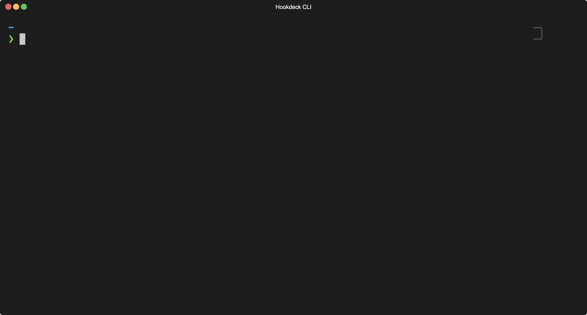

# Hookdeck CLI

Using the Hookdeck CLI, you can forward your webhooks to your local webserver. We offer unlimited **free** and **permanent** webhook URLs. You webhook history is preserved between session and can be viewed, replayed or used for testing by you and your teammates.

Hookdeck CLI is compatible with most of Hookdeck features such as filtering and fan-out delivery. You can use Hookdeck CLI to develop or test your webhook integration code locally.

Although it uses a different approach and philosophy, it's a replacement for ngrok and alternative HTTP tunnel solutions.

Hookdeck for development is completely free, and we monetize the platform with our Production offering.

For a complete reference, see the [CLI reference](https://hookdeck.com/cli)



## Installation

Hookdeck CLI is available for macOS, Windows, and Linux for distros like Ubuntu, Debian, RedHat and CentOS.

### macOS

Hookdeck CLI is available on macOS via [Homebrew](https://brew.sh/):

```sh
brew install hookdeck/hookdeck/hookdeck
```

### Windows

Hookdeck CLI is available on Windows via the [Scoop](https://scoop.sh/) package manager:

```sh
scoop bucket add hookdeck https://github.com/hookdeck/scoop-hookdeck-cli.git
scoop install hookdeck
```

### Linux Or Without package managers

To install the Hookdeck CLI on Linux without a package manager:

1. Download the latest linux tar.gz file from https://github.com/hookdeck/hookdeck-cli/releases/latest
2. Unzip the file: tar -xvf stripe_X.X.X_linux_x86_64.tar.gz
3. Run the executable: ./hookdeck

### Docker

The CLI is also available as a Docker image: [`hookdeck/hookdeck-cli`](https://hub.docker.com/r/hookdeck/hookdeck-cli).

```sh
docker run --rm -it hookdeck/hookdeck-cli version
hookdeck version x.y.z (beta)
```

## Usage

Installing the CLI provides access to the `hookdeck` command.

```sh-session
hookdeck [command]

# Run `--help` for detailed information about CLI commands
hookdeck [command] help
```

## Commands

### Login

Login with your Hookdeck account.

```sh-session
hookdeck login
```

> Login is optional, if you do not login a temporary guest account will be created for you when you run other commands.

### Listen

Start a session to forward your webhooks to an HTTP server.

```sh-session
hookdeck listen <port-or-URL> <source-alias?> <connection-query?>
```

Hookdeck works by routing webhooks receive for a given `source` (ie: Shopify, Github, etc.) to its defined `destination` by connecting them with a `connection` to a `destination`. The CLI allows you to receive webhooks for any given connection and forward them to your localhost at the specified port or any valid URL.

Each `source` is assigned a Webhook URL, which you can use to receive webhooks. When starting with a fresh account, the CLI will prompt you to create your first source. Each CLI process can listen to one source at a time.

Contrarily to ngrok, **Hookdeck does not allow to append a path to your Webhook URL**. Instead, the routing is done within Hookdeck configuration. This means you will also be prompted to specify your `destination` path, and you can have as many as you want per `source`.

> The `port-or-URL` param is mandatory, webhooks will be forwarded to http://localhost:$PORT/$DESTINATION_PATH when inputing a valid port or your provided URL.

#### Listen to all your connections for a given source

The second param, `source-alias` is used to select a specific source to listen on. By default, the CLI will start listening on all eligible connections for that source.

```sh-session
$ hookdeck listen 3000 shopify

👉  Inspect and replay webhooks: https://dashboard.hookdeck.com/cli/events

Shopify Source
🔌 Webhook URL: https://events.hookdeck.com/e/src_DAjaFWyyZXsFdZrTOKpuHnOH

Connections
Inventory Service forwarding to /webhooks/shopify/inventory
Orders Service forwarding to /webhooks/shopify/orders


⣾ Getting ready...

```

#### Listen to a subset of connection

The 3rd param, `connection-query` can be used to filter the list of connections the CLI will listen to. The connection query can either be the `connection` `alias` or the `path`

```sh-session
$ hookdeck listen 3000 shopify orders

👉  Inspect and replay webhooks: https://dashboard.hookdeck.com/cli/events

Shopify Source
🔌 Webhook URL: https://events.hookdeck.com/e/src_DAjaFWyyZXsFdZrTOKpuHnOH

Connections
Inventory Service forwarding to /webhooks/shopify/inventory


⣾ Getting ready...

```

#### Viewing and interacting with your webhooks

Webhooks logs for your CLI can be found at https://dashboard.hookdeck.com/cli/events. Events can be replayed or saved at any time.

### Logout

Logout of your Hookdeck account and clear your stored credentials.

```sh-session
hookdeck logout
```

### Version

Print your CLI version and whether or not a new version is available.

```sh-session
hookdeck version
```

### Completion

Configure auto-completion for Hookdeck CLI. It is run on install when using Homebrew or Scoop. You can optionally run this command when using the binaries directly or without a package manager.

```sh-session
hookdeck completion
```

## License

Copyright (c) Hookdeck. All rights reserved.

Licensed under the [Apache License 2.0 license](blob/master/LICENSE).
